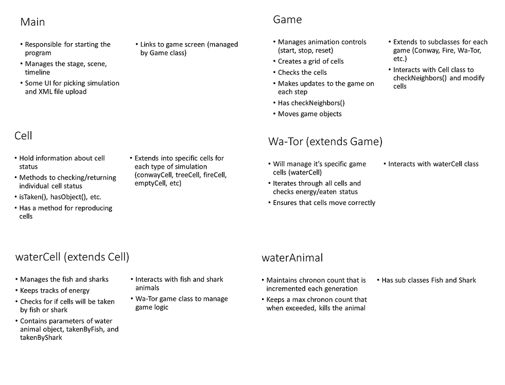

CS 308 Cell Society Team 12 Design Plan
===================

### Introduction
Our goal is to make a Cellular Automata simulation program that can run various type of CA rules such as Conway’s Game of Life, Schelling’s Model of Segregation, Wa-Tor, etc. We want to create an interface that allows users to run all these types of simulations through XML input files specifying the type of simulation. 

The user has access to a GUI that allows him or her to upload the configuration files, effectively altering the grid and the placement of the cells, and can control the speed of the simulation after the simulation has started. He or she can also reset the level from the simulation screen by uploading a configuration file. The simulation logic will be controlled by each of the block classes’ logic, but the user will not be able to access any of the methods used to determine the rules of each CA simulation - that is predetermined based on the type of CA that user wants to run. 

### Overview
We decided that most of the work will go into these few classes: Main, Game, Cell, and GameObject.

The main class will take care of the start up screen, and manage the stage, scene, and animation for running the simulations. It will prompt the startup screen where the user can specify the simulation type, and the setup file they want to upload for the starting configurations.

The Game class can be extended into each simulation type, and will take care of simulation logic. It will create all the cells, and then iterate through them for checking updates (such as a void CheckNeighbors() method, which will iterate through an ArrayList of Cells) It will interact the game objects and cells that are created for the simulation, and will responsible for checking each cell on the update cycle. However, the updating will be done by the cells themselves.

The Cell class will similarly be extended for each simulation type (conwayCell, waterCell), and will hold parameters and methods such as isDead, reproduce, checkNeighbor, random number generators for games that require random movement, etc. The cell size will be passed into the constructor, so the size can scale depending on the user specified simulation dimensions. 

The GameObject class can be used for games that have multiple objects that fill the cell (ex: Wa-Tor will have fish and shark objects). Some simulations will not need to have GameObjects such as Conway’s Game Of Life, since you only need an on/off which can be done in the Cell class. GameObjects holds data that determines if a cell should be shown or not, such as step count, lives count, etc. GameObjects will be shown in the Cell location during the simulation.




Some example code that might help visualize how we will format our code.
```Java
Cells[][] grid = new Cells[100][100];

grid[30][27] = new Water_Cell(new Fish(), false);

move(row, col, new_row, new_col);

move(int old_row, int old_col, int new_row, int new_col) {
	grid[new_row][new_col] = grid[old_row][old_col];
	grid[new_row][new_col].getAnimal.setLocation(new_row, new_col);
	grid[old_row][old_col].setAnimal(null);
}
```
### User Interface
The user will mostly be interfacing with the splash screen, as the other parts are Cellular Automata simulation that the user can control the step speed of. The splash screen will allow the user to upload a data file which will contain the necessary information to run the simulation (Title, author, grid dimension, initial configuration). Once you start the simulations, the user will have speed control, a stop, start, and reset button. Users can reset from the same configuration or a different data file.

Error checking can be added to make sure that the grid size is valid, and that the cell data is correct for the game type specified, and that they can properly constructed for the game. The simulation will be mostly hands off from the user.


### Design Details

The game class has control over the Grid class and the GameObjects. The Game will initialize both of these classes. The main purpose of the Game class is to display our game through JavaFX, determine the movement of the GameObjects, and actually "do" the movement. The Grid class and the GameObjects class both will hold qualities and functions within them. The Game class will then call and access these methods to determine the appropriate movement for each GameObject. The Grid class and the GameObject don't necessarily have any interactions between them - the Grid class might contain GameObjects, but calling each other's functions and methods will not be required. This will prevent any dependencies, and the Game class will do the heavy lifting. 

When the simulation is started, the interface that the user sees is not directly connected yet to any of the games. Until the user chooses a game, it will be a general splash screen that we will eventually add interactive buttons to. When the user chooses the corresponding game, the appropriate Game subclass for the game will be created, which will in turn generate the appropriate Grid classes and game object classes. The simulation will operate by itself, determining moves and refreshing the scene as often as needed until the user decides to stop the simulation. The user has the ability to control the speed of the simulation by pressing one of two buttons in the user interface. When these buttons are pressed, the value of variable used to represent the speed (possibly called speed) will change by “x” in either direction, where “x” is a value we will determine through experimentation. In doing so, the rate at which the screen refreshes/updates the cells will change, having thus altered the game speed.

Below are the design specific details that we plan to incorporate into each superclass and class. We have included what we think will be valuable methods and how the methods help the classes interact with each other. 

* Main Screen  
    * Link to superclass for games
* Superclass for games
    * Animation controls (start, stop, reset)
    * Method for moving objects
    * Method for checking neighbors
    * GUI Elements
    * List of possible game subclasses
        * Game 1: Schelling’s model of segregation
           * Global Grid (Array of blocks)
           * Getters and Setters for grid size, simulation speed, threshold
           * Method to check neighbors
           * Method for moving unsatisfied agent (random, from user, etc.)
        * Game 2: Wa-Tor World model of predator-prey relationships
           * Fish and shark cell objects
           * Shark needs energy to survive
                * Will be dealt with the Shark class
            * For advanced implementation: deal with decisions for two or more fish that want/have to occupy same location (with level of priority)
        * Game 3: Spreading of Fire
            * Extend cell object to have tree cell (contains info on empty, burning, tree) that calls super() on the default constructor
            * Can pass in their own probability of catching fire
            * Have a get status method in the tree cell class
            * Methods will exist in the game class that handles the simulation logic
        * Game 4: Conway’s Game of Life
            * Contains a grid of Conway cells
        * Game 5: Brian’s Brain
        * Game 6: Byl’s Loop
        * Game 7: Langton’s ant
* Game subclass
    * XML files based on user game choice
    * Take inputs from the user (grid size, game speed, configurations)
    * Implement Grid class based on inputs to create scene 
* Cells
    * Two constructors
        * Default constructor with no parameters
        * Constructor with single parameter - object specific to the game (Object)
    * Methods for checking state of cells: isTaken(), isNotTaken(), willBeRemoved()
    * Method for “reproducing” that will return a grid coordinate of where reproduction will occur
    * Subclass: Water_Cell
        * Additional constructor parameters containing boolean for willBeTakenByFish() and willBeTakenByShark()
        * WIll also contain method for willBeTakenByFish() (avoiding collisions among multiple fish)
        * Will also contain method for willBeTakenByShark() (avoiding collisions among multiple sharks and between sharks and fish)
        * Will contain a getAnimal() method to retrieve the animal there if isTaken() returns true
    * Subclass: Tree_Cell
        * Methods: isEmpty(), isTree(), or isBurning()
        * Color attribute
    * Subclass: Conway_Cell
        * Methods: isAlive(), isDead()
* Objects specific to Games
    * Wa-Tor:
        * Water_Animals superclass
            * Chronon count (incremented until max chronon count)
            * Max chronon count (randomly generated)
            * Location (row and column number)
                * getLocation() will return row and col numbers
                * setLocation() will set new row and col numbers
            * Method for canReproduce() (some of them can be abstract)
        * For each Fish
            * Same color (green)
        * For each Shark
            * Same color (blue)
            * Method for isDead(), isAlive()
            * Energy
                * When we increment chronon count, we decrement energy count
                * getEnergy(), setEnergy(), eatsFish()

*Extending the game*

There are different ways to extend the game: adding a simulation, creating a new grid for each game, and adding an object for each game.

To add a simulation to the game, a new subclass for the game must be added, extending the game superclass. Since it will inherit behavior and methods for animation controls and GUI switching, inter-cell movement of game-specific objects, and neighbor checking criteria, any modifications to these methods will be represented in overridden methods. Otherwise, any methods that are specific to the game that require inter-cell communication or external control unrelated to the contents of the game grid (e.g. GUI-related specifications) will be managed by the superclass in private instance variables. These private instance variables will also store values that are read from extracted data in XML files (see section called “Reading XML file” for this process).

To add a new grid for the game, a subclass of the “Cells” superclass must be created specific to the game. For example, a grid subclass for the simulation, “Spreading of Fire,” could be titled, “TreeCells.” In this way, the subclass will inherit the major, common characteristics as all or most cells, including checking cell states and storing objects (contents of each cell). Specifically for the subclass, if movement exists, game-specific objects are required, and a constructor will be called as so; if movement does not exist, there is a default constructor with no parameters. This choice will depend on the game rules.

To create game-specific objects, a separate class can be created to store characteristics specific to the object, including color and energy. For games with multiple objects with similar characteristics, a superclass can be created to represent a class of objects, and a specific object can have a subclass extending this class. For example, with Wa-Tor, we have two objects: “Fish” and “Shark.” Since a shark has several common characteristics of a fish, we can create a “Water_Animals” superclass that implements the commonalities between both water animals, and specific attributes of either the fish or the shark can be found in the object-specific classes.

*XML file*

To set up the file for a simulation, you will need to start off my specifying the type of simulation you want to run in the top node (ex: <type>conway</type>), and one of the children will specify the dimension of the grid (<dimension_x>60</dimension_x>, <dimension_y>60</dimension_y>) so these parameters can easily be parsed with getElementsByTagName. For each kind of simulation, you can specify the kind of initial pieces (for Conway you can specify on pieces, and all others will default to off, for Fire you can specify all three different kind of pieces, and non specified will default to empty.) Data needed for the piece constructor will have to be specified by in the node within a piece.

*Reading XML file*

We will use standard DOM XML parser for information. A setup class, possibly a setup super class and each kind of simulation will extend for each type of simulation (super class will getType, getLocation, etc, but the setupConway sub class will create the blocks. The setup class will hold each block in an arraylist, and can pass this into a simulation driver class that will handle the rest of the game logic. The XML parser will be called from the Game superclass, and the data will be imported into the necessary Cells or GameObjects to initialize the simulation.

Here is how we will deal with some of the use cases:

* Apply the rules to a middle cell: set the next state of a cell to dead by counting its number of neighbors using the Game of Life rules for a cell in the middle (i.e., with all its neighbors)
    *  Apply the rules to a middle cell: to get to a middle cell, we would be iterating through all of the cells in the grid and checking neighbors for each one. If the number of neighbors for a cell is equivalent to the maximum number of possible neighbors, then we know we have reached a middle cell. We would then apply the rules of movement to this middle cell, which would determine the possible movements of the cell. Then, the Game class will randomly choose where the object in the cell would move next. 
* Apply the rules to an edge cell: set the next state of a cell to live by counting its number of neighbors using the Game of Life rules for a cell on the edge (i.e., with some of its neighbors missing)
    * Apply the rules to an edge cell: the rules of movement will be the same as for a middle cell, except we would have to check for the eight possible cases where the cell is on an edge. This is important because we do not want to be checking outside of the bounds of the grid, which would throw an array out of bounds exception.  
* Move to the next generation: update all cells in a simulation from their current state to their next state and display the result graphically
    * Move to the next generation: we will iterate through all of the cells with objects in them, and we will update the values based on a set of boolean values (i.e. isDead(), willBeTaken(), etc). Some games involve movement (i.e. Segregation, Wa-Tor, etc), so the Game subclasses will use their respective rules (by overriding methods from their superclass) to determine where each cell moves. Other games require updates upon a single scan across the cells (i.e. Spreading of Fire, Game of Life, etc.). Then, our Game subclass will apply these moves by calling the update method, which will graphically update through JavaFX.
* Set a simulation parameter: set the value of a parameter, probCatch, for a simulation, Fire, based on the value given in an XML file
    * The simulation parameter for the value of probCatch will be read from the XML file by extracting the data for the corresponding node (probably called “fire”). A private instance variable, called probCatch, in the “Fire” game subclass will store this value and will be used later in the game to determine the probability of a tree burning. 
* Switch simulations: use the GUI to change the current simulation from Game of Life to Wator
    * To switch simulations, the game superclass will contain different game options. This interface is maintained by the superclass because it is common across all specific game subclasses. In the basic implementation, the game options will be presented in a ComboBox using JavaFX. For later more advanced implementation, we will create image buttons (screenshots of the different simulations) linking to the different games as an enhancement of the GUI. For now, consider the basic implementation. When the user selects a new simulation, the current frame (e.g. for Game of Life) is closed, and a new frame is created in the game superclass corresponding to the specific game subclass (e.g. Wa-Tor). The XML file corresponding to the new game is changed, and the respective user’s parameters from this file are read in as they would during a transition from the main menu screen to any game. This smooth user interaction allows for a free-flowing linking across classes, superclasses, and subclasses. 

### Design Considerations
Where we will put methods to move cells, update simulation frame, either in the superclass or in the subclass for the game. How we plan to extend each class to implement each different type of simulation. We also need to consider how to most efficiently implement cells either as their own abstract class and implement them in the simulation class, or as a specific cell type class for each simulation. We will have to see how we want to implement the cell and what methods we would want each type of cell to have, and then consider if each type of cell is similar/different enough to warrant a superclass or not.

What the correct rules for each game are - for each game, we will have to determine the rules of how objects move around and how they interact with each other. Basically, what the objects *DO* between each step. This will vary between each game. We will have a superclass of games which will include an abstract method for rules, letting us edit the rules of each game without interfering with the other games. 

How we are going to scale each cell, since the user gets to define the grid size but the window size remains the same. We want to use a cell class that will take care of displaying the simulation pieces (game of life piece, predator, prey, fish, shark, etc), but then when creating the cells, we will have to make them the right size, and make the displayed cells scale. 

What the best way will be to parse the information from the XML file, and what data we should put in the XML that the user can specify, and what we should put in a file manager class that will set up the simulation. We will want to decide what parameters we will set by default, and makes it easy for the user to set up the game without have to specify each block in a large grid. We also have to decide how much control the user will have to control the parameters of the simulation (if they can decide speed, default block type, etc) from the XML file.

### Team Responsibilities
All members of the group will constructively work together to implement the three cellular automata simulations described in the link assignments of the project page: Schelling’s model of segregation, Wa-Tor World model of predator-prey relationships, and Spreading of Fire. Work will be divided up among the members based on class implementation. This approach for the first three CA simulations ensures that the basic requirements are met. To exceed these requirements, we will extend the plan to include at least 2-3 additional simulations. After breaking down the class structure and concepts for each of these simulations, including inheritance relationships between superclasses and subclasses, grid cell object parameters, motion control, and neighbor checking requirements, each member will be responsible for implementing one of the simulations independently. Throughout the project, collaboration and collective consent will be key, especially for high-level implementation of multiple class dependencies.
